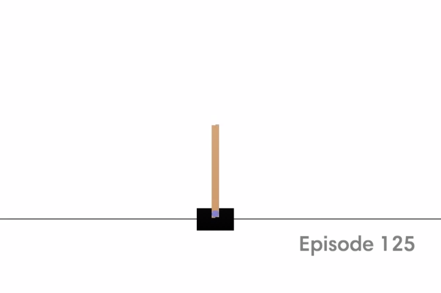
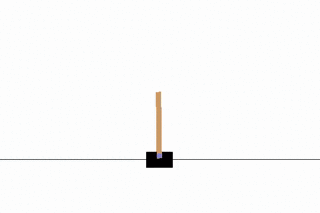
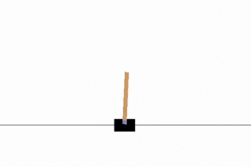
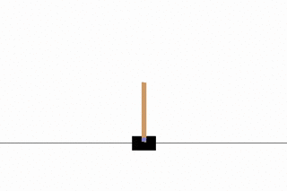
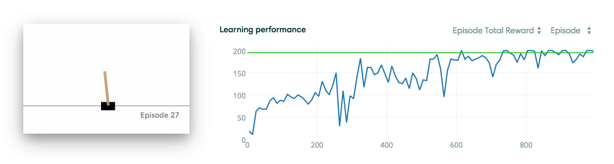

Basic Reinforcement Learning Tutorial 4: Q-learning in OpenAI gym
===================================================

This tutorial provides a walkthrough on how to use Q-learning in the OpenAI gym environment to solve some of the challenges proposed. For an introduction to Q-learning refer to [Tutorial 1: Q-learning](../tutorial1/README.md). For an introduction to OpenAI gym refer to [Tutorial 3:](../tutorial3/README.md).

## Table of Contents
- [The CartPole problem](#cartpole)
- [Adapting Q-learning](#qlearning)
- [Results](#results)

<div id='cartpole'/>
### The CartPole problem

The CartPole problem consists of a pole attached by an un-actuated joint to a cart, which moves along a frictionless track. The system is controlled by applying a force of +1 or -1 to the cart. The pendulum starts upright, and the goal is to prevent it from falling over. A reward of +1 is provided for every timestep that the pole remains upright. The episode ends when the pole is more than 15 degrees from vertical, or the cart moves more than 2.4 units from the center.




<div id='qlearning'/>
### Adapting Q-learning

To build a solution for this problem, I'd reuse the code from [Tutorial 1: Q-learning](../tutorial1/README.md) and adapt it to the OpenAI gym. The core `QLearn` class remains pretty much the same:

```python
class QLearn:
    def __init__(self, actions, epsilon, alpha, gamma):
        self.q = {}
        self.epsilon = epsilon  # exploration constant
        self.alpha = alpha      # discount constant
        self.gamma = gamma      # discount factor
        self.actions = actions

    def getQ(self, state, action):
        return self.q.get((state, action), 0.0)

    def learnQ(self, state, action, reward, value):
        '''
        Q-learning:
            Q(s, a) += alpha * (reward(s,a) + max(Q(s') - Q(s,a))            
        '''
        oldv = self.q.get((state, action), None)
        if oldv is None:
            self.q[(state, action)] = reward
        else:
            self.q[(state, action)] = oldv + self.alpha * (value - oldv)

    def chooseAction(self, state, return_q=False):
        q = [self.getQ(state, a) for a in self.actions]
        maxQ = max(q)

        if random.random() < self.epsilon:
            minQ = min(q); mag = max(abs(minQ), abs(maxQ))
            # add random values to all the actions, recalculate maxQ
            q = [q[i] + random.random() * mag - .5 * mag for i in range(len(self.actions))] 
            maxQ = max(q)

        count = q.count(maxQ)
        # In case there're several state-action max values 
        # we select a random one among them
        if count > 1:
            best = [i for i in range(len(self.actions)) if q[i] == maxQ]
            i = random.choice(best)
        else:
            i = q.index(maxQ)

        action = self.actions[i]        
        if return_q: # if they want it, give it!
            return action, q
        return action

    def learn(self, state1, action1, reward, state2):
        maxqnew = max([self.getQ(state2, a) for a in self.actions])
        self.learnQ(state1, action1, reward, reward + self.gamma*maxqnew)

```

Something interesting to note when facing real-life problems is that the space of observations and actions is generally continuous. This makes life of a Reinforcement Learning algorithm terrible thereby peolple involved in the field tend to create abstractions by slicing the space into a discrete set of possibilities. We'll do the same for the CartPole problem using the following supporting functions (courtesy of [@ carlos-aguayo's solution](https://gym.openai.com/evaluations/eval_kWknKOkPQ7izrixdhriurA)):

```python
def build_state(features):    
    return int("".join(map(lambda feature: str(int(feature)), features)))

def to_bin(value, bins):
    return numpy.digitize(x=[value], bins=bins)[0]
```

The actual discretization of the space is performed using the `pandas` library through:
```python
    # Number of states is huge so in order to simplify the situation
    # we discretize the space to: 10 ** number_of_features
    cart_position_bins = pandas.cut([-2.4, 2.4], bins=n_bins, retbins=True)[1][1:-1]
    pole_angle_bins = pandas.cut([-2, 2], bins=n_bins, retbins=True)[1][1:-1]
    cart_velocity_bins = pandas.cut([-1, 1], bins=n_bins, retbins=True)[1][1:-1]
    angle_rate_bins = pandas.cut([-3.5, 3.5], bins=n_bins, retbins=True)[1][1:-1]
```

Note that in this particular scenario `number_of_features=4` thereby we have `10^4=10 000` possible scenarios in the space. 

-----

It's relevant to note that in order to get good results with this Q-learning implementation, the negative reward had to be modified to `-20` (instead of 0).

-----

<div id='results'/>
### Results

One could argue that to get a good performance with Q-learning we should visit each space once (which implies at least 10 000 generations). Let's test it experimentally using the following hyperparameters:
- `alpha=0.5`
- `gamma=0.90`
- `epsilon=0.1`

#### 100 generations



#### 500 generations



#### 1000 generations


The overall results after 1000 generations is pretty decent.

