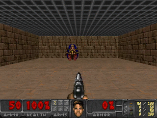

Playing DOOM with Deep Reinforcement Learning (unfinished)
-------

This tutorial implements an agent that artificially learns how to play the game [DOOM](https://es.wikipedia.org/wiki/Doom) using deep learning through reinfocement learning techniques. The AI programmed *learns* how to play by using solely the visual input provided by the images and the rewards that come from the environment.

### Exploring the DOOM environment

Let's explore the observaction and action spaces:
```python
import gym
env = gym.make('DoomBasic-v0')
print(env.action_space)
# High-Low43
print(env.observation_space)
# Box(480, 640, 3)

```

From these outputs we can observe that the action should be a 43-binary element (`True`,`False`) and the observation space is an RGB image of 640x480 pixels. While the observation space is pretty obvious, the action one is not.

According to OpenAI gym's environment description, the following actions apply for this particular environment:

```python

# Abstract actions in a list
action_attack = [False]*43
action_attack[0] = True

action_right = [False]*43
action_right[10] = True

action_left = [False]*43
action_left[11] = True

actions = [action_attack, action_left, action_right]
```

### A silly, random DOOM player



The following code snippet will get you a randomized DOOM player:

```python
import gym
env = gym.make('DoomBasic-v0')
for i_episode in range(20):
    observation = env.reset()
    for t in range(100):
        env.render()
        print(observation)
        action = env.action_space.sample()
        observation, reward, done, info = env.step(action)
        if done:
            print("Episode finished after {} timesteps".format(t+1))
            break
```
